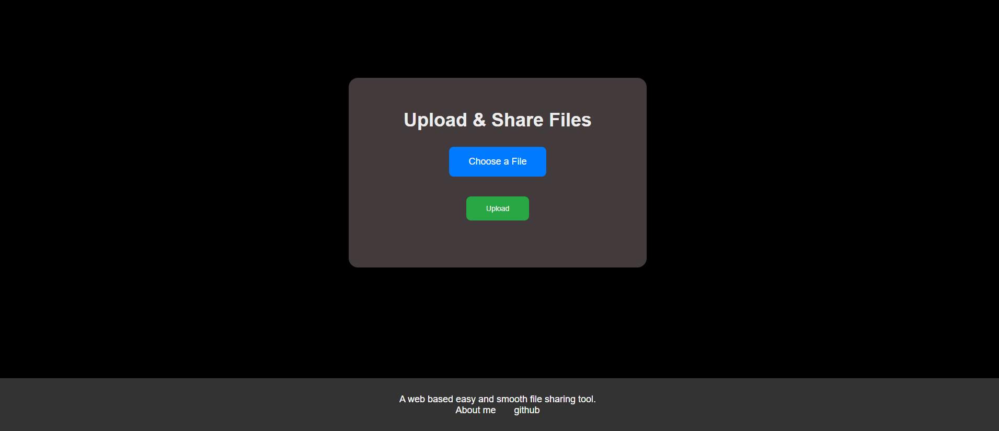

# Web Based File Sharing Tool

This project is a web-based file sharing tool that allows users to upload files and share them using unique links. It provides a convenient way to share files with others without the need for email attachments or file transfer applications.

## Features

- **File Upload**: Users can easily upload files from their local machine to the web application.
- **Unique Link Generation**: Each uploaded file is assigned a unique link that can be shared with others.
- **File Download**: Users can download files shared with them by accessing the unique link.
- **Security**: The application ensures the security of uploaded files and prevents unauthorized access.
- **User-Friendly Interface**: The user interface is designed to be intuitive and easy to navigate.

## Getting Started

To get started with the file sharing tool, follow these steps:

1. Clone the repository to your local machine.
2. Install the required dependencies by running `npm install`.
3. Start the application by running `npm start`.
4. Access the application in your web browser at `http://localhost:3000`.

## Usage

1. On the home page, click on the "Upload" button to select a file from your local machine.
2. Once the file is uploaded, you will be provided with a unique link.
3. Share the unique link with others to allow them to download the file.
4. To download a file shared with you, simply access the unique link in your web browser.

## Demo

<a href="https://file-share-8ryy.onrender.com">Click here</a>

## Contributing

Contributions to this project are welcome. To contribute, please follow these steps:

1. Fork the repository.
2. Create a new branch for your feature or bug fix.
3. Make your changes and commit them with descriptive commit messages.
4. Push your changes to your forked repository.
5. Submit a pull request to the main repository.

## License

This project is licensed under the [MIT License](https://opensource.org/licenses/MIT).
